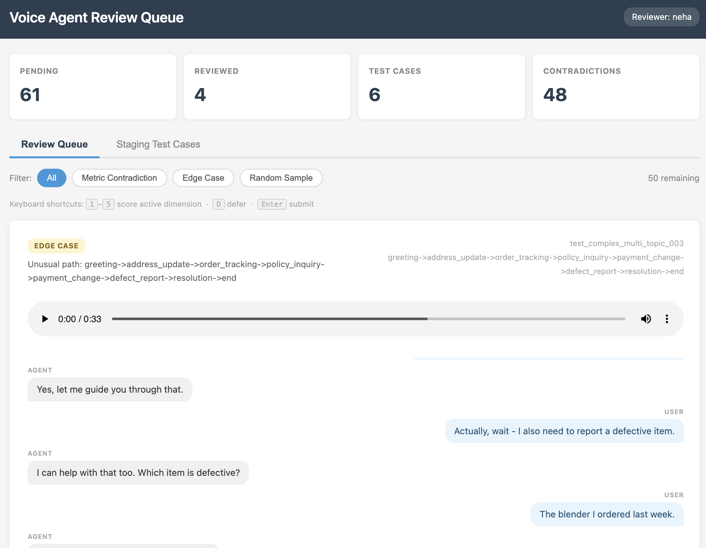
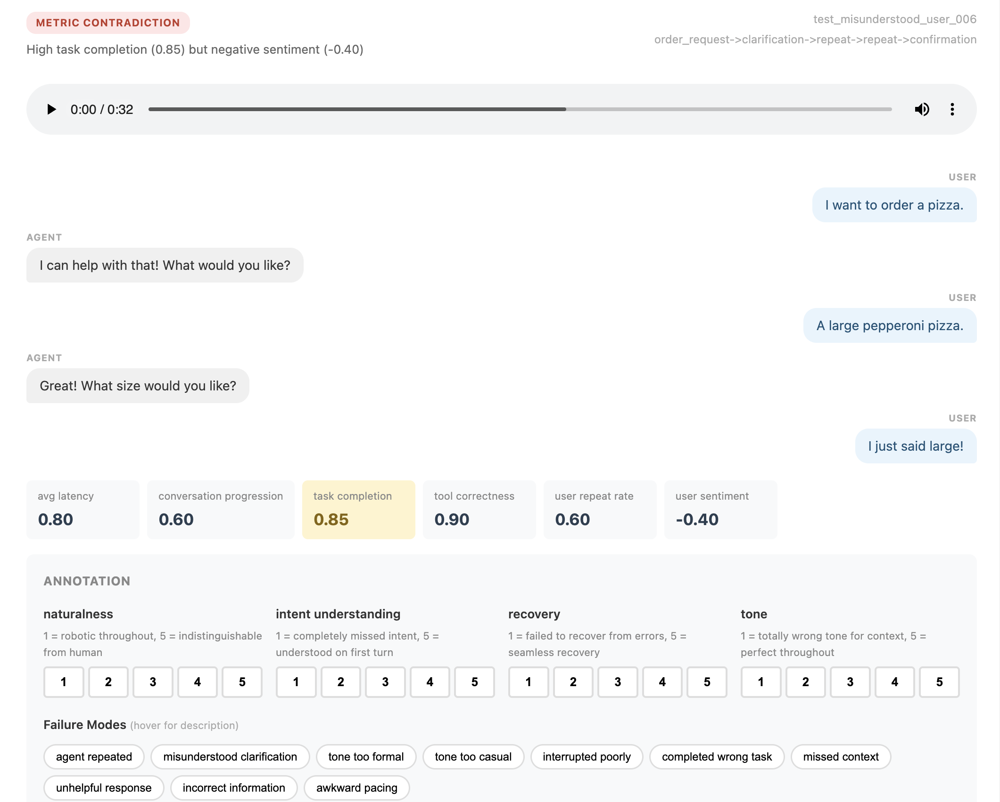
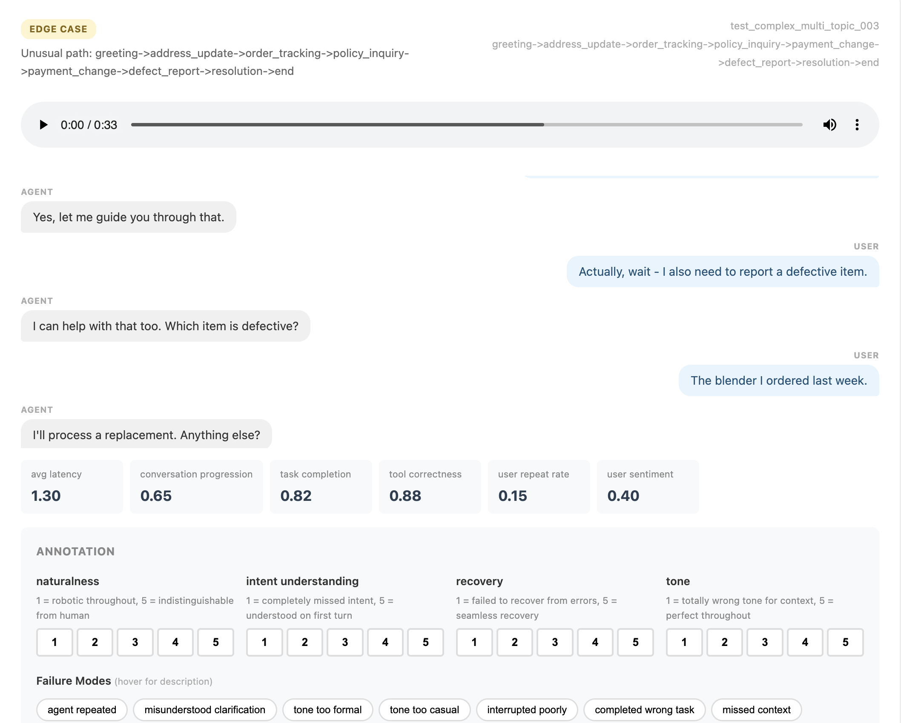

# Voice Agent Review Queue

A sampling and review system for **voice agent** conversations. Ingests test results via webhook, surfaces conversations for human review, and generates new test cases from annotated failure modes.



---

## Tech Stack

| Layer | Technology |
|-------|-----------|
| Backend | Python 3, Flask |
| Database | SQLite (swappable to PostgreSQL) |
| Frontend | Vanilla JS, HTML/CSS — no framework, no build step |
| API | REST over HTTP, webhook-driven ingestion |
| Deployment | Docker / docker-compose |

---

## What It Does

- **Smart sampling** — automatically selects transcripts for review based on metric contradictions, edge cases, and random baseline sampling
- **Structured annotation** — reviewers rate conversations on dimensions like naturalness, intent understanding, recovery quality, and tone
- **Test case generation** — creates new test cases from annotated failure modes and queues them for approval
- **Metric reliability tracking** — records which automated metrics correlate with human-identified quality issues

---

## How It Works

```
Eval Platform  ──webhook──►  eval-review-queue  ──queues──►  Human Review  ──generates──►  Test Cases
(test results)               (smart sample)             (annotate)                    (staged)
```

1. Your eval platform sends a webhook when a test run completes
2. The system selects a subset of transcripts based on sampling rules
3. Reviewers annotate flagged conversations in the web UI
4. Annotations automatically produce staged test cases for approval


**Why 1–5 scores instead of pass/fail?** Voice agent quality is a gradient. A conversation can complete the task and still have awkward phrasing, a wrong tone, or one bad recovery turn — all of which binary scoring would mark as "pass." Your automated metrics already give you pass/fail. Human review exists to capture what binary can't: how natural it felt, whether the agent recovered gracefully, whether the tone fit the context. Dimension scores also let you detect regressions over time (naturalness averaged 4.2 before a prompt change, 3.1 after) — a resolution that binary rates don't provide.

---

## Getting Started

### Prerequisites

- Python 3.9+
- pip

### Install and Run

```bash
git clone https://github.com/nehasriva/eval-review-queue.git
cd eval-review-queue

pip install -r requirements.txt

python backend/app.py
```

The server starts on `http://localhost:5001`. The database is initialized automatically on first run.

### Docker

```bash
docker-compose up
```

See `docs/QUICKSTART.md` for a full walkthrough.

---

## Usage

### 1. Configure Your Eval Platform Webhook

Point your eval platform to:

```
POST http://your-server:5001/api/webhook/test-complete
```

Payload format:

```json
{
  "test_run_id": "run_abc123",
  "test_cases": [
    {
      "test_case_id": "test_001",
      "transcript": "User: Hello\nAgent: Hi, how can I help?...",
      "audio_url": "https://...",
      "conversation_path": "greeting->intent_capture->tool_call->response",
      "metrics": {
        "task_completion": 0.95,
        "user_sentiment": -0.4,
        "avg_latency": 1.2,
        "tool_correctness": 0.98,
        "conversation_progression": 0.45
      },
      "metadata": {
        "test_scenario": "angry_customer",
        "persona": "frustrated_user"
      }
    }
  ]
}
```


### 2. Review Transcripts

Open `http://localhost:5001` and work through the queue:

- Each transcript shows why it was flagged (metric contradiction, edge case, or random sample)
- Automated metrics are displayed inline — metrics involved in the trigger reason are highlighted
- Transcripts render as conversation turns (User / Agent), not raw text
- Rate on 4 dimensions (1–5): Naturalness, Intent Understanding, Recovery Quality, Tone Appropriateness — each with a built-in rubric so reviewers stay calibrated
- Tag applicable failure modes (e.g. `agent_repeated`, `missed_context`, `tone_too_formal`) — hover any tag for a description
- Not sure? Hit **Skip for now** — the transcript returns next session
- Submit — annotation saved, test case generated

**Keyboard shortcuts** for fast review sessions:

| Key | Action |
|-----|--------|
| `1` – `5` | Score the current dimension (advances automatically) |
| `D` | Defer / skip |
| `Enter` | Submit |

Filter the queue by trigger type to prioritize — e.g. work through all metric contradictions first before sampling baseline.

### 3. Approve Staged Test Cases

Navigate to the **Staging Test Cases** tab to review and approve generated tests before they're added to your suite.

---

## Edge Case Detection

The system surfaces two categories of edge cases automatically:

**Metric contradiction** — high task completion alongside negative sentiment:



**Unusual conversation paths** — transcripts that deviate from common patterns:



---

## Configuration

### Sampling Thresholds

Edit `TranscriptSelector` in `backend/app.py`:

```python
def _check_metric_contradictions(self):
    task_completion = self.metrics.get('task_completion', 0)
    sentiment = self.metrics.get('user_sentiment', 0)

    if task_completion > 0.8 and sentiment < -0.3:  # Adjust thresholds
        return 'High completion but negative sentiment'
```

### Random Sampling Rate

Default is 10%. Adjust in `_random_sample()`:

```python
def _random_sample(self):
    return random.random() < 0.1  # 0.05 for 5%, etc.
```

### Failure Mode Templates

Add custom failure modes in `TestCaseGenerator.FAILURE_MODE_TEMPLATES`:

```python
FAILURE_MODE_TEMPLATES = {
    'your_custom_failure': {
        'template': 'Test description',
        'config': {
            'check_type': 'your_check',
            'assertion': 'What should pass'
        }
    }
}
```

---

## API Reference

| Method | Endpoint | Description |
|--------|----------|-------------|
| `POST` | `/api/webhook/test-complete` | Receive test results from eval platform |
| `GET` | `/api/transcripts/pending` | List transcripts awaiting review. Params: `page`, `per_page`, `trigger_type` |
| `POST` | `/api/transcripts/<id>/annotate` | Submit annotation for a transcript |
| `POST` | `/api/transcripts/<id>/defer` | Defer a transcript for later review |
| `GET` | `/api/test-cases/staging` | List generated test cases in staging |
| `POST` | `/api/test-cases/<id>/approve` | Approve a staged test case |
| `GET` | `/api/stats` | Review queue statistics |

---

## Production Notes

- **Authentication**: Add auth middleware — reviewer identity is currently stored in browser `localStorage`
- **Database**: SQLite by default; migrate to PostgreSQL for production workloads
- **Webhook source**: Can also query your eval platform's database directly instead of using webhooks
- **CI/CD integration**: Export approved test cases to your test suite repository via the staging approval flow

---

## Contributing

Fork the repository and customize the sampling triggers, failure mode templates, and test case generation logic for your domain. Pull requests welcome.

## License

MIT
